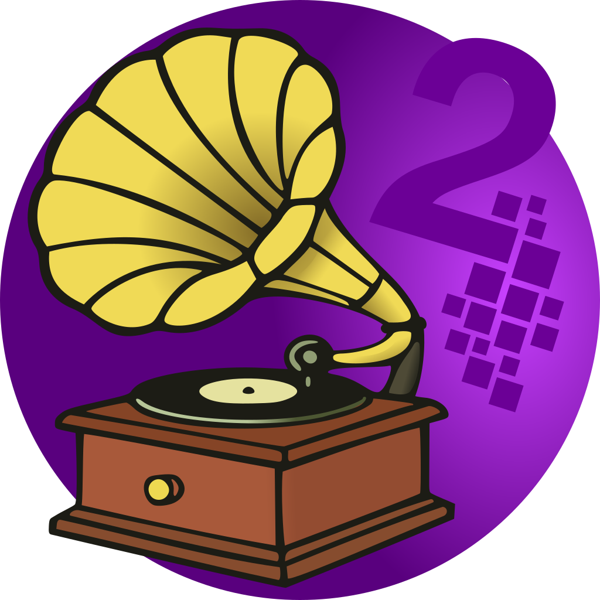

# JingleBox2

<p align="center">
  
</p>

**JingleBox2** is a cross-platform audio pad launcher built with **.NET** and **Avalonia UI**, for **radio, streaming and live audio**. Fire jingles from pads, record and trim your own takes, and write beds and stings in a tracker that hosts VST3 and CLAP plugins.

The pages you play on are kept apart from the pages you set things up on, so nothing moves under your hand while you are on air.

<p align="center">
  <a href="../../releases/latest">
    
  </a>
</p>

---

## The pages

**RECORD** captures takes and keeps them on a shelf the rest of the app plays from. Pick an input, watch the meter and the clip light, set the gain, record. On Linux you can capture anything in the audio graph, including another program's output; on Windows you can capture what an output device is playing. Click a take to see its waveform, then play, trim, normalise or rename it. WAV files from anywhere on disc can be imported, and anything that is not already 16-bit is converted on the way in.

**PADS** is where a pad is set up: its name, the file or stream URL it plays, its colour, whether it loops, its fades and its level, plus an effect slot that takes the same plugins the tracker uses.

**FIRE** is the page you use while the show is running. Large pads, click or MIDI to fire, click again to stop, as many at once as you like. Nothing on this page can be set up by accident, and the transport's only live button is stop.

**TRACKER** writes songs: patterns, an order list, and instruments the song owns rather than borrows. Instruments come off four machines, Zampler, BongaBong, Ouroboros and OddSkilla, or from a VST3 or CLAP plugin. Every track has a mixer strip with pan, mute, solo and ducking, and an insert chain.

**SETTINGS** holds the output device, the engine's sample rate and plugin cushion, the recording input, MIDI devices and what each one drives, plugin folders, the theme, and the log switch.

---

## Around the app

- **The transport** at the top of the window belongs to the page you are on: a take on RECORD, the pads on FIRE, the song on TRACKER. The space bar works it. When something is running on a page you have left, the transport keeps showing it but only stop works, and stopping hands it back to the page in front of you.
- **MIDI** triggers pads and types notes into the tracker. Each device is given a job in SETTINGS, so a controller can drive the pads, the tracker, or both.
- **Themes**: twelve, as six pairs of dark and light. Dark and Light are the plain pair; Neon, Industrial, Orchid, Citrus and Ember each come both ways.
- **Profiles**: a whole set of pads saved under a name. Built and switched on PADS, and FIRE says which one is loaded.

---

## How it works

Audio runs through **BASS** (ManagedBass). Pads are streams the engine owns; the tracker mixes its own voices into one stream and hands the result to the same device.

Plugins run **in a process of their own**, one per plugin, and so does the scan. A plugin that crashes takes only itself down: an effect passes its audio through, an instrument goes quiet, and the panel offers to start it again. The child process is this same executable started with `--plugin-host`, talking over a socket with the audio in shared memory.

Songs, recordings, instruments and settings are files you can copy, hand to someone else, or back up. Nothing lives only in a database.

---

## Requirements

- .NET SDK 10
- Windows or Linux (x64, and linux-arm64)
- An audio device BASS can open

---

## Build and run

```bash
dotnet restore
dotnet build
dotnet run

dotnet publish -c Release -r win-x64      # Windows
dotnet publish -c Release -r linux-x64    # Linux
```

The BASS binaries in `native/` are copied to the output by the build.

---

## Where things are kept

Everything the app keeps lives in one folder: `%APPDATA%\JingleBox2` on Windows, `~/.config/JingleBox2` on Linux.

```bash
config.json      # settings, pad profiles, window size
recordings/      # your takes, 16-bit WAV
songs/           # one JSON file per song
instruments/     # the machines and the plugins you have added
crashes/         # what the app was doing when a run ended badly
jinglebox.log    # off unless switched on
```

---

## Switches

| Variable | What it does |
| --- | --- |
| `JB_LOG=1` | Writes the log without going to SETTINGS first |
| `JB_LOG_DIR` | Where the log goes, for a plugin's own process |
| `JB_PLUGINS_INPROCESS=1` | Loads plugins in the app's process instead of their own |
| `JB_PLUGIN_TRACE=1` | Has each plugin process write what it is doing to `/tmp/jinglebox-plugin-<pid>.log` |

---

## Project structure

```bash
JingleBox2/
├─ Audio/              # BASS engine, recording, waveforms, routing
│  └─ Plugins/         # VST3 and CLAP: scanning, hosting, the out-of-process bridge
├─ Tracker/            # Songs, patterns, the player, the machine rack
│  └─ Synth/           # Voices, envelopes, the synth mixer
├─ Midi/               # Input, routing to pads and to the tracker
├─ Config/             # Settings model and JSON persistence
├─ ViewModels/         # MVVM, CommunityToolkit
├─ Views/              # Avalonia views, and the app's own drawn controls
├─ Themes/             # One resource dictionary per theme
├─ Diagnostics/        # The log and the crash report
├─ Presets/            # Starting sounds shipped with the app
├─ native/             # BASS binaries per platform
├─ installer/windows/  # Inno Setup script
└─ packaging/fedora/   # RPM spec and desktop entry
```

---

## Design notes

- **Playing is not setting up.** FIRE and PADS are the same pads seen two ways: one page fires them, the other builds them. Neither page can do the other's job by accident. The matrix is rows by columns, anything from 4 to 16 pads in total, set in SETTINGS: 4x4, 2x8 and 1x16 are all allowed.
- **The engine is the truth.** Playback state is read from BASS rather than remembered alongside it.
- **A song owns its instruments.** Opening a song sounds the way it was saved, whatever the rack has become since.
- **Nothing is only in memory.** Unsaved tracker work is kept in a rescue file while you work, and dropped the moment you save for real.

---

## Status

Actively developed, and in daily use. The pad launcher, recorder, tracker, plugin hosting and MIDI are all working; expect the edges to keep moving.

---

## License

Licensed under the **GNU General Public License v2.0 (GPL-2.0-only)**, the same license the Linux kernel uses. See `LICENSE` for the full text.

---

## Author

Built by **Peter van de Pas** for radio and live audio use.
