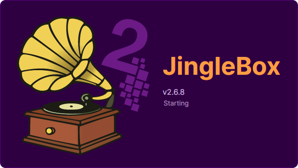
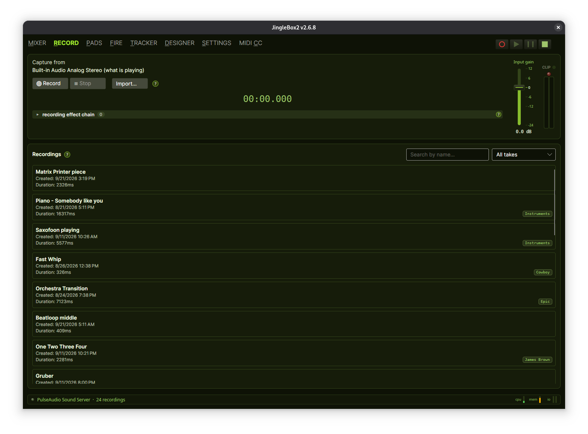
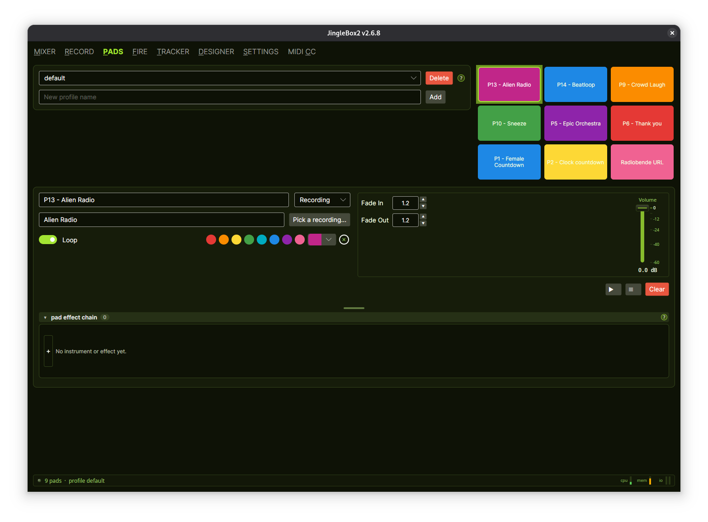
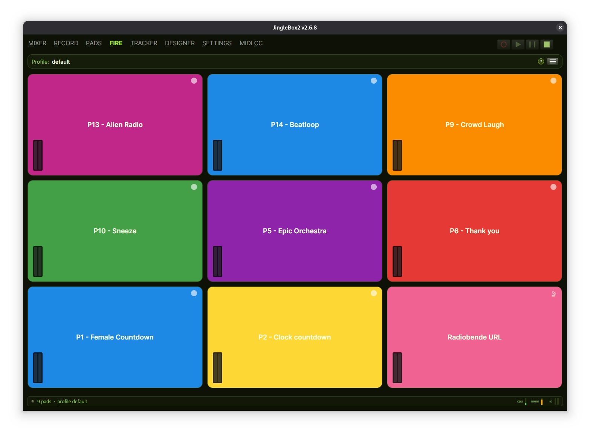
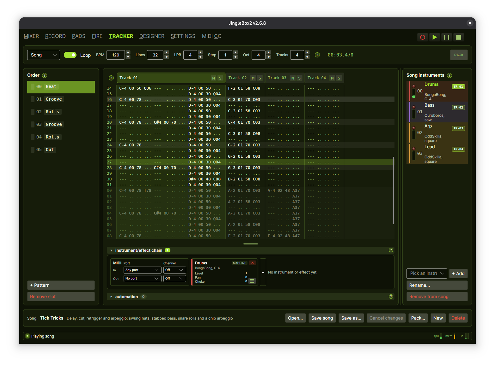
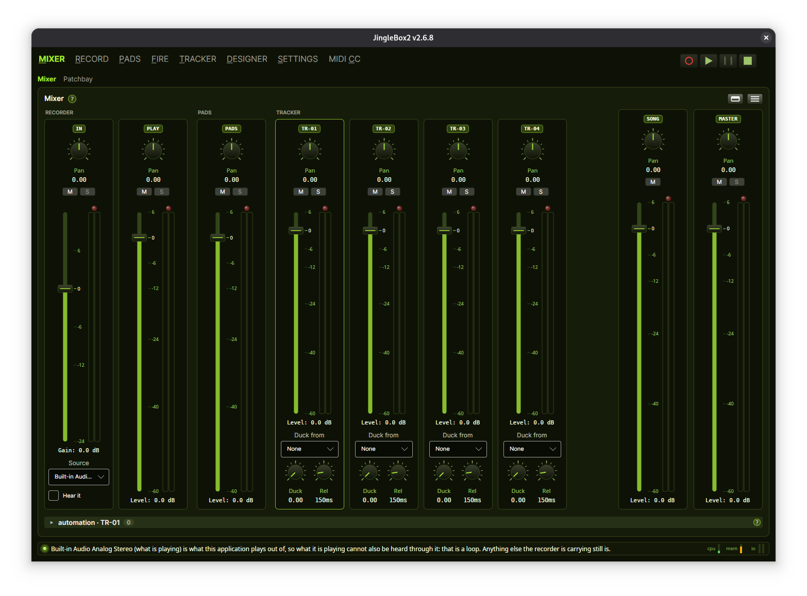
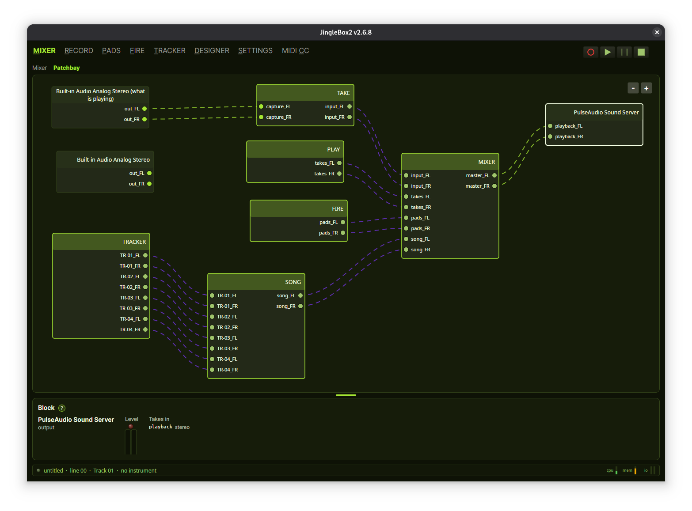
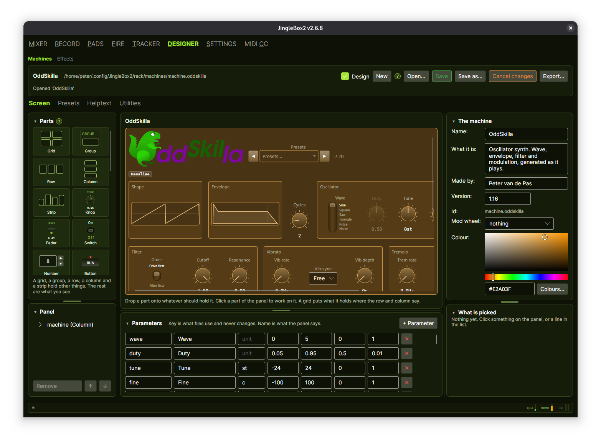
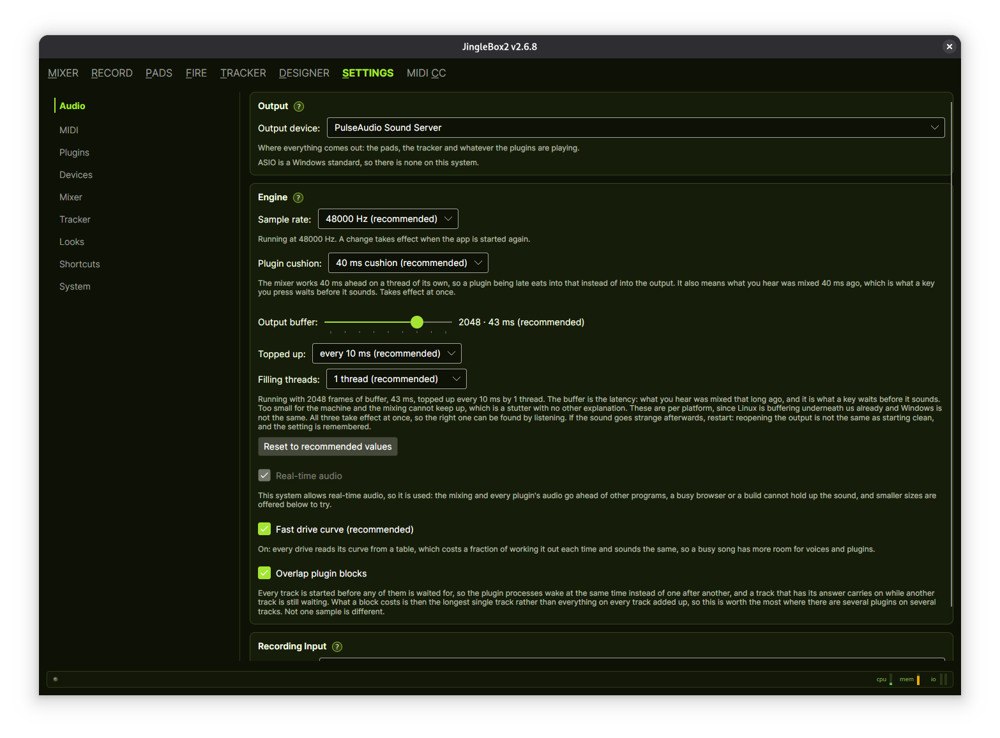
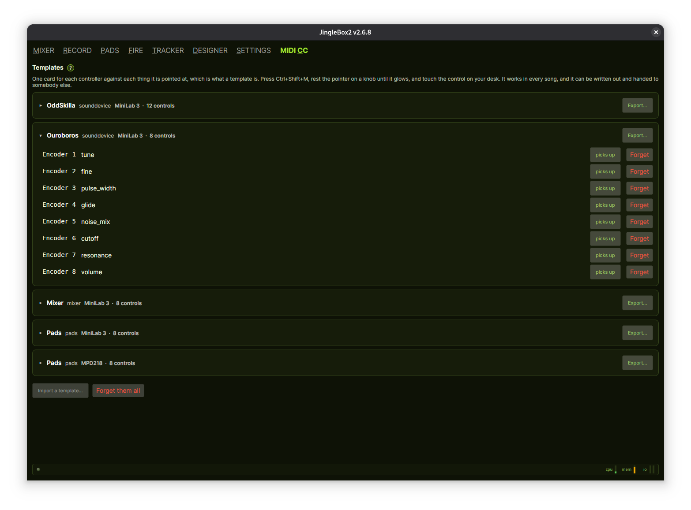

# JingleBox2

<p align="center">
  
</p>

**JingleBox2 is an audio workstation for radio and live shows.** It fires jingles from a wall of pads, records and edits takes, and writes music in a tracker with its own synths, samplers and drum machines beside VST3 and CLAP plugins. A mixer with automation sits over all of it, and any MIDI controller can drive it by pointing at a control on screen and touching the hardware. It runs on Windows and on Linux, the 64 bit Raspberry Pi included, and is built with .NET and Avalonia UI.

The pages you play on are kept apart from the pages you set things up on, so nothing moves under your hand while you are on air.

<p align="center">
  <a href="../../releases/latest">
    
  </a>
</p>

---

## What it does

- **Playout.** Up to 32 pads, fired by mouse, by keyboard or from a MIDI pad controller. Each pad plays a recording or an internet stream, with its own colour, fades, loop and effect chain. A whole set of pads is saved as a profile and switched in one go.
- **Recording.** Capture any input, and on Linux any program in the PipeWire graph as well. Trim, normalise, name and file each take, run it through an effect chain, and keep the untreated copy beside it.
- **Music.** A pattern tracker: an order list, loop ranges, up to eight note columns a track, chords recorded live, and a MIDI in and out on every track. A song owns its instruments, so it opens sounding the way it was saved.
- **Sound devices of its own.** Seven soundmachines ship with it (Zampler, BongaBong, Chopper, Ouroboros, OddSkilla, Operetta and Recording) and seven effects (EchoBox, Sweeper, Roaster, Shifter, Ringer, Widener and Phaser). New ones are laid out in DESIGNER without writing code and handed to somebody else as a zip.
- **Plugins.** VST3 and CLAP instruments and effects, each running in a process of its own: a plugin that crashes takes itself down and nothing else, which matters when the show is live.
- **Mixer.** Level, pan, mute, solo, ducking and an insert chain on every track, a master strip with its own chain, and automation lanes for any parameter.
- **Hardware.** Any MIDI controller works by pointing, with no file needed. Profiles for the Arturia MiniLab 3, KeyLab mkII and KeyStep Pro, the Akai MPD218 and the Korg nanoKONTROL2 add names and a ready layout, Mackie Control surfaces get motor faders and their display, and a set of links is a template file you can save and pass on.

---

## The pages

**RECORD** captures takes and keeps them on a shelf the rest of the app plays from. Pick an input, watch the meter and the clip light, set the gain, record. On Linux you can capture anything in the audio graph, including another program's output; on Windows you can capture what an output device is playing. A fresh take waits on a scratchpad until you name it and save it. Click a take to see its waveform, then play, trim, normalise or rename it, and file it under a category of your own. WAV files from anywhere on disc can be imported, and anything that is not already 16-bit is converted on the way in.

<p align="center"></p>

**PADS** is where a pad is set up: its name, the recording it plays or the stream URL it opens, its colour, whether it loops, its fades and its level, plus an effect chain that takes the same effects and plugins the tracker uses.

<p align="center"></p>

**FIRE** is the page you use while the show is running. Large pads, click or MIDI to fire, click again to stop, as many at once as you like. Nothing on this page can be set up by accident, and the transport's only live button is stop.

<p align="center"></p>

**TRACKER** writes songs: patterns, an order list, and instruments the song owns rather than borrows. An instrument comes off one of the soundmachines on the rack or from a VST3 or CLAP plugin. A track plays as many notes at once as it has note columns, and the instrument says what becomes of a note when the next one arrives in its column: cut it, let it play its own release under the new note, or leave it holding. Under the pattern sit the track's effect chain and its automation lanes.

<p align="center"></p>

**MIXER** is the desk: a strip per track with level, pan, mute, solo and ducking, a master strip with its own effect chain, and strips for the pads and the recording input. Beside it, the patchbay draws where the audio goes: what the recorder takes in, how the pads, the takes and the tracks reach the mixer, and which output the mix leaves through.

<p align="center"></p>

<p align="center"></p>

**DESIGNER** is where the face of a soundmachine or an effect is laid out: drag knobs, faders, switches, pads and keyboards onto it, say what each one is wired to, and write its presets and its help page. It shows along the top when you ask for it in SETTINGS.

<p align="center"></p>

**SETTINGS** holds the output device, the engine's sample rate and buffer sizes, the recording input, MIDI ports and what each one drives, control surfaces, the device registry, plugin folders, the theme, the shortcuts and the log switch.

<p align="center"></p>

**MIDI CC** lists every link from a controller to something on screen, one card per controller and target, and imports and exports them as template files.

<p align="center"></p>

---

## Around the app

- **The transport** at the top of the window belongs to the page you are on: a take on RECORD, the pads on FIRE, the song on TRACKER. The space bar works it, on every window. When something is running on a page you have left, the transport keeps showing it but only stop works, and stopping hands it back to the page in front of you.
- **Pointing** is how a controller is mapped. Press Ctrl+Shift+M, rest the pointer on a knob, a fader or a button anywhere in the app, and touch the control on the hardware.
- **Undo** works on every page that edits something: the pattern, the song, the instruments, the pads, the designer and the recordings shelf.
- **Help** is built in. Ctrl+H opens it, every page has a badge leading to its own topic, and each device carries a help page of its own.
- **Themes**: twelve, as six pairs of dark and light. Dark and Light are the plain pair; Neon, Industrial, Orchid, Citrus and Ember each come both ways.

---

## How it works

Audio runs through **BASS** (ManagedBass). Pads, the tracker and the recording input each play into a bus of their own, and the busses are mixed into one output: a sound card, a PipeWire node on Linux, or an ASIO driver on Windows.

Plugins run **in a process of their own**, one per plugin, and so does the scan. A plugin that crashes takes only itself down: an effect passes its audio through, an instrument goes quiet, and the panel offers to start it again. The child process is this same executable started with `--plugin-host`, talking over a socket with the audio in shared memory.

Sound devices are laid out rather than coded. The engines are compiled in, and a soundmachine or an effect is a face over one of them, described in a `machine.json` or an `effect.json` the designer writes and drawn by the app: what the description does not draw, nobody draws. `Rack.SoundDevices` is what a soundmachine is and `Rack.Controls` is what it is drawn with. `LICENSE.EXCEPTION` names `Rack.SoundDevices`.

**The machine registry** is what this installation has, and it is the only thing that answers that. Two folders and only one of them is yours: beside the program is what ships, a source to take a machine from and never the answer to what is on the rack, and under the application folder is what you have actually registered. Removing a machine is not losing it, since the shipped copy stays where it was.

Registering is something you do, and so is unregistering, so what is recorded is what has been *offered* rather than what is present. A machine that ships and has never been offered arrives on the rack; one you threw out stays thrown out. A machine that ships is brought up to date file by file when a new version of the program lands, and nothing is deleted, so a preset you saved onto a machine survives. A machine from somebody else's zip is imported here, and lives alongside them.

Everything asks it: what the rack shows, what a panel is drawn from, what a song can sound, and which machines a song is missing are one question with one answer.

Songs, recordings, instruments and settings are files you can copy, hand to someone else, or back up. Nothing lives only in a database.

Every seam is an interface, and the prose lives on the interface: what a thing is for, why it works the way it does, and what was got wrong on the way there. `CS1591` is left switched on so the compiler says when that lapses, and the build runs at nought warnings of any kind.

---

## Tests

```bash
dotnet test Tests/JingleBox2.Tests.csproj
```

2421 of them, in about half a minute, with no window and no hardware. They run in CI on every branch and every pull request, on Linux **and** Windows, because two of them are genuinely platform specific: a path is written with a separator that is not the same character on the two systems, and those are exactly the tests that would pass on one machine for a year and fail on somebody else's. The release workflow runs them first and every job that makes an artefact waits on them, because a release is the one build nobody gets to take back.

What is covered is the parts that can be got wrong quietly: the MIDI wire, controller profiles and codecs, shortcuts, the histories, patterns and their edits, a song written down and poured back, the mix, the filters and the drive curve, the sample window and its loop, a WAV read and written, and the bridge's message bodies. Several of those tests exist because that exact thing was wrong once.

---

## Requirements

- .NET SDK 10
- Windows or Linux (x64, and arm64, which is the 64 bit Raspberry Pi)
- An audio device BASS can open

---

## Build and run

```bash
dotnet restore
dotnet build
dotnet run

dotnet publish -c Release -r win-x64      # Windows
dotnet publish -c Release -r linux-x64    # Linux
dotnet publish -c Release -r linux-arm64  # Raspberry Pi, 64 bit
```

The BASS binaries in `native/` are copied to the output by the build. `bassasio.dll` is the ASIO add-on and is copied on Windows only; without it the output list has no ASIO drivers in it and SETTINGS says why.

A release carries an installer per platform: an Inno Setup `.exe` and a portable zip for Windows, an RPM for Fedora, and a `.deb` for Debian and Ubuntu on `amd64` and for the Raspberry Pi on `arm64`. The Pi package wants the 64 bit Raspberry Pi OS; there is no 32 bit one, since BASS for `armhf` is not in this tree and a package that installs and then cannot open the audio library is worse than none.

```bash
sudo apt install ./jinglebox2_<version>_arm64.deb
```

---

## Where things are kept

Everything the app keeps lives in one folder: `%APPDATA%\JingleBox2` on Windows, `~/.config/JingleBox2` on Linux.

```bash
config.json      # settings, pad profiles, window size
recordings/      # your takes, 16-bit WAV
deleted/         # takes you threw away this session, so undo can fetch them back
songs/           # one .jibx per song: a zip holding song.json and each plugin's patch
                 # Pack writes one with the recordings inside it too, for handing over
rack/machines/   # the soundmachines registered here, a folder each
rack/effects/    # and the effects, the same way
instruments/     # the instruments on your rack, and the plugins you have added
controllers/     # a .json saying what a controller is, a .lua saying what it does
crashes/         # what the app was doing when a run ended badly
jinglebox.log    # off unless switched on, rolled over at a few megabytes
```

---

## Switches

| Variable | What it does |
| --- | --- |
| `JB_LOG=1` | Writes the log without going to SETTINGS first. `JB_LOG=midi,plugin` picks areas |
| `JB_LOG_DIR` | Where the log goes, for a plugin's own process |
| `JB_PLUGINS_INPROCESS=1` | Loads plugins in the app's process instead of their own |
| `JB_PLUGIN_TRACE=1` | Has each plugin process write what it is doing to `/tmp/jinglebox-plugin-<pid>.log` |

---

## Project structure

```bash
JingleBox2/
├─ Audio/              # BASS engine, recording, waveforms, routing
│  └─ Plugins/         # VST3 and CLAP: scanning, hosting, the out-of-process bridge
├─ Tracker/            # Songs, patterns, the player, and the instruments a song owns
│  └─ Synth/           # Voices, envelopes, the mixer
├─ SoundDevices/       # What is on the rack: the shared rules, and the two worlds
│  ├─ SoundMachines/   # A device that is played, and becomes an instrument in a song
│  └─ SoundEffects/    # A device that is not played, and sits on a track's chain
├─ Midi/               # Input, routing to pads and to the tracker
├─ Music/              # Notes, pitch and keyboards, knowing nothing about patterns
├─ Files/              # Where the app keeps things, and writing a file whole
├─ Config/             # Settings model and JSON persistence
├─ Controllers/        # Controller profiles and their Lua codecs
├─ Shortcuts/          # What a key can ask for, and who answers
├─ Scripting/          # The Lua sandbox
├─ Rack.SoundDevices/  # What a device on the rack is: the contract an outside one links to
├─ Rack.Controls/      # What its face is drawn with: knobs, faders, panels
├─ ViewModels/         # MVVM, CommunityToolkit
├─ Views/              # Avalonia views, and the app's own drawn controls
├─ Themes/             # One resource dictionary per theme
├─ Help/               # What the app explains about itself
├─ Tests/              # xunit, no window and no hardware
├─ Diagnostics/        # The log and the crash report
├─ rack/               # What ships: machines/ and effects/, a folder each,
│                     #   manifest, panel, presets and help inside
├─ native/             # BASS binaries per platform, and bassasio for win-x64
├─ installer/windows/  # Inno Setup script
└─ packaging/fedora/   # RPM spec and desktop entry
```

---

## Design notes

- **Playing is not setting up.** FIRE and PADS are the same pads seen two ways: one page fires them, the other builds them. Neither page can do the other's job by accident. The matrix is rows by columns, from 4 pads up to 16, or 32 with the extended switch on, set in SETTINGS: 4x4, 2x8 and 1x16 are all allowed.
- **The engine is the truth.** Playback state is read from BASS rather than remembered alongside it.
- **A machine is not an instrument.** A machine is a face over one of the built-in engines: a folder holding a panel, a badge, its presets and its own sounds, made in the designer and travelling as a zip. An instrument is a machine in use, with your name and your settings, stored inside the song. Two instruments can come off one machine.
- **A song owns its instruments.** Opening a song sounds the way it was saved, whatever the rack has become since.
- **The registry decides what you have.** A machine is registered or it is not, and that one list answers what the rack shows, what a panel is drawn from and what a song can sound.
- **An instrument is on a machine.** Without that machine there is no instrument to play, so it makes no sound and has no panel. Opening a song says which machines are not registered, and opening one of those instruments says so and stops.
- **Nothing is only in memory.** Unsaved tracker work is kept in a rescue file while you work, and dropped the moment you save for real.

---

## Status

Actively developed, and in daily use. The pad launcher, recorder, tracker, plugin hosting and MIDI are all working; expect the edges to keep moving.

---

## License

Licensed under the **GNU General Public License v2.0 (GPL-2.0-only)**, the same license the Linux kernel uses. See `LICENSE` for the full text.

JingleBox2 plays its audio through **BASS**, a library by Un4seen Developments that is not free software. Its terms let a non-commercial entity, such as an individual, use it free of charge in a product that makes no money, through sales, advertising or otherwise; anything else needs a licence from [un4seen.com](https://www.un4seen.com/bass.html). `LICENSE.EXCEPTION` gives explicit permission to link JingleBox2 with BASS and to ship its binaries alongside it, so the builds on the releases page are properly licensed. The condition is on whoever distributes software built on BASS: JingleBox2 is given away, so using it costs nothing, and anyone who wants to make money distributing it needs a BASS licence for that.

Instruments and effects are exempt. `LICENSE.EXCEPTION` grants permission to write a module against JingleBox2's plugin interfaces, the machine interface and the protocols it uses to talk to a plugin in its own process, and to distribute that module under whatever terms you like. Sounds, presets, recordings and songs are data and were never covered by the license at all.

---

## Author

Built by **Peter van de Pas** for radio and live audio use.
