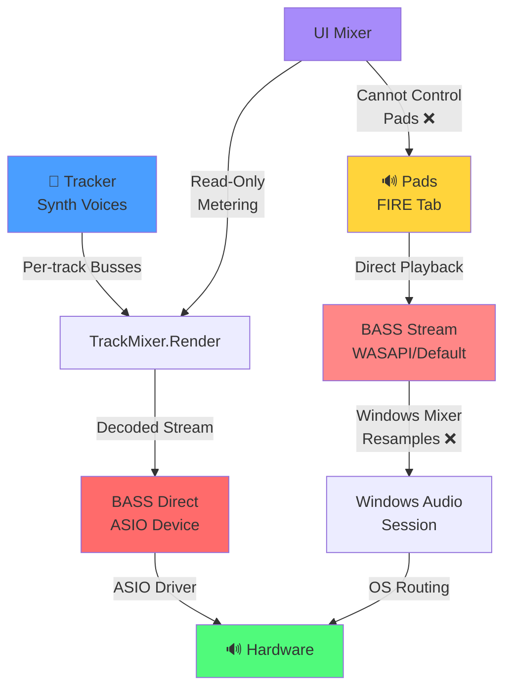
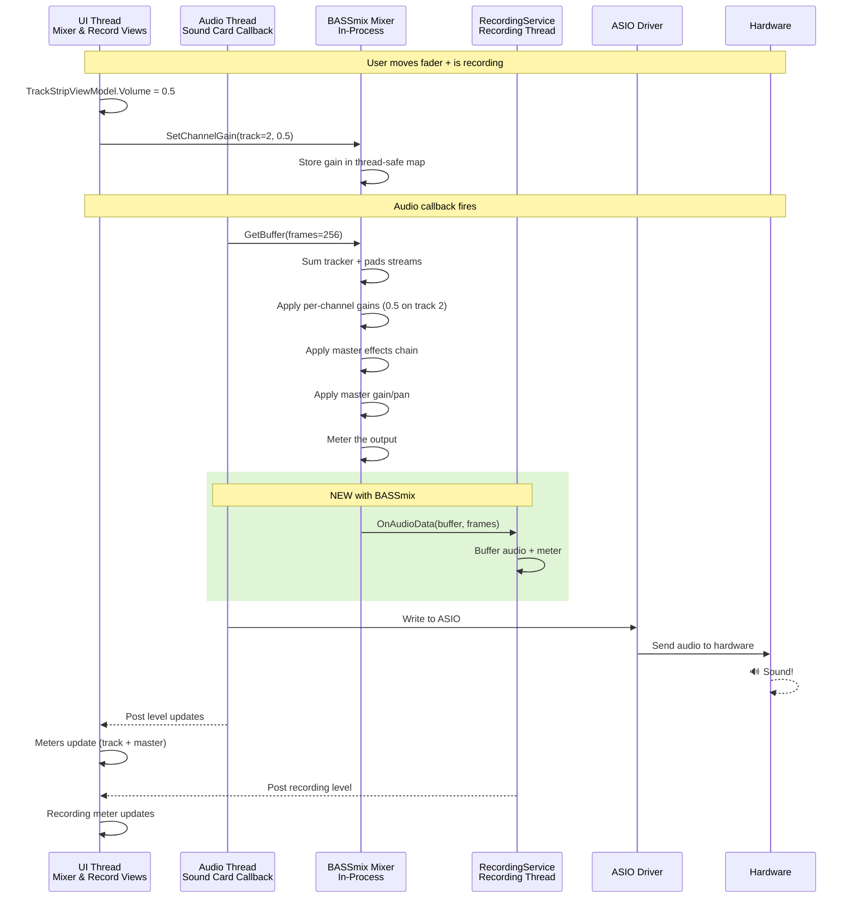
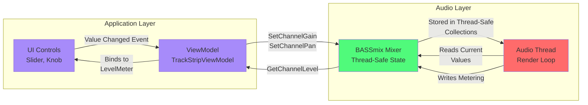
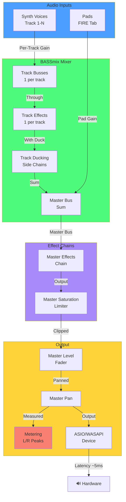
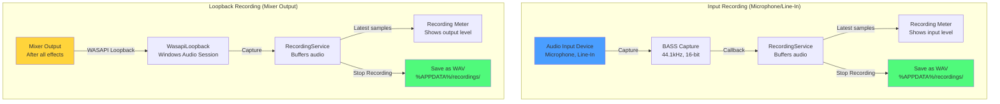
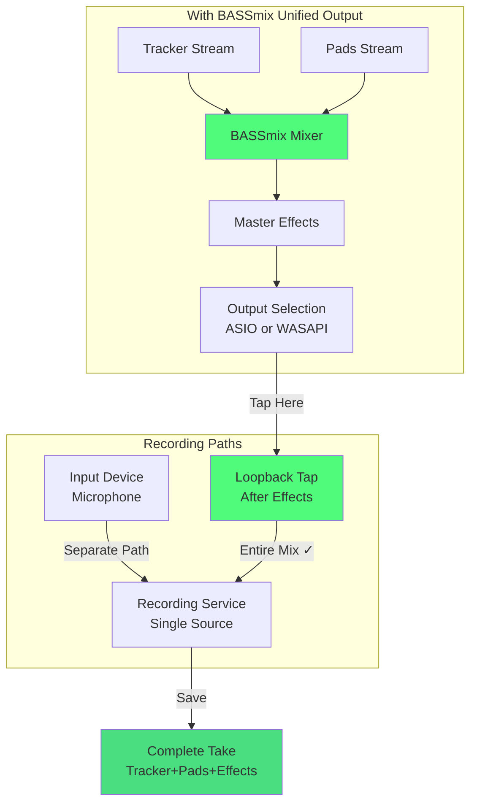
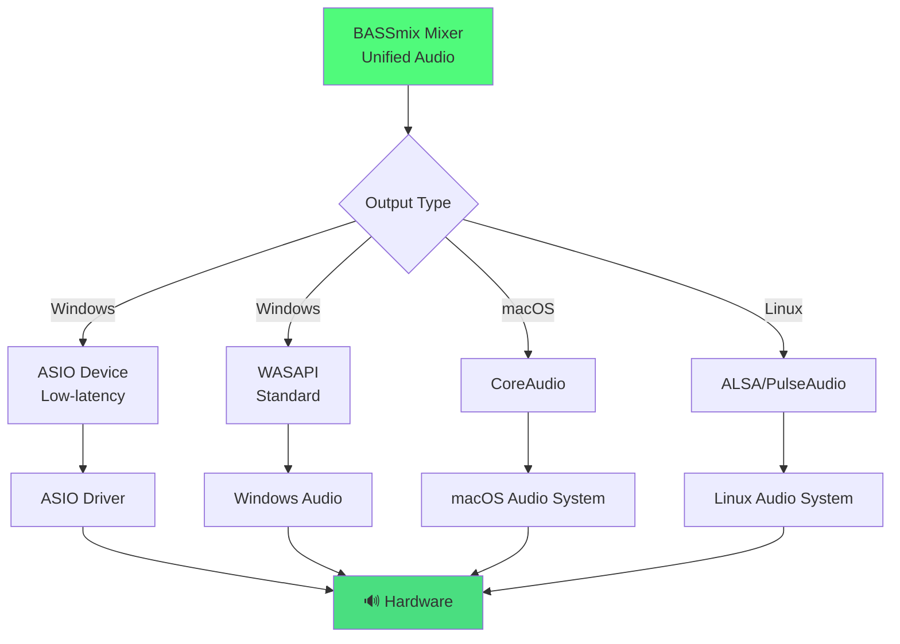
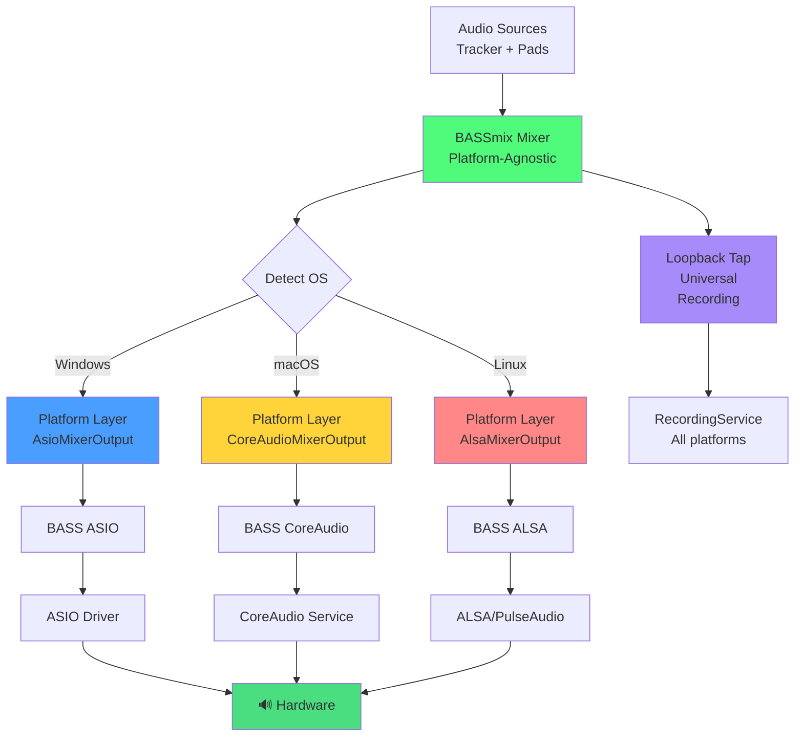

# ASIO + BASSmix Integration Design

**Date:** 2026-09-03  
**Status:** Design Document (Not Yet Implemented)  
**Author:** Claude Code Analysis

---

## Audio Path Diagrams

### Current Architecture (Broken - Two Separate Paths)



### Proposed Architecture (Fixed - Single Unified Path with BASSmix)

```mermaid
graph TD
    A["🎵 Tracker<br/>Synth Voices"] -->|Decoding Stream| B["BASSmix Mixer<br/>In-Process"]
    E["🔊 Pads<br/>FIRE Tab"] -->|Decoding Stream| B
    
    B -->|Master Bus<br/>Unified Mix| C["Master Effects<br/>Chain"]
    C -->|Unified Audio| D["BASS Output<br/>ASIO/WASAPI"]
    D -->|Native Rate<br/>✓ Low Latency| F["🔊 Hardware"]
    
    H["UI Mixer<br/>TrackStripViewModel"] -->|Read/Write<br/>Faders, Pans| B
    H -->|Per-Track<br/>Levels"] -->|Gets Accurate<br/>Metering ✓| B
    
    J["Master Meter<br/>MasterLevel"] -->|Reads from<br/>Mixer| B
    
    style A fill:#4a9eff
    style E fill:#ffd43b
    style B fill:#50fa7b
    style C fill:#a78bfa
    style D fill:#ff6b6b
    style F fill:#4ade80
    style H fill:#a78bfa
    style J fill:#a78bfa
```

---

## Executive Summary

JingleBox2's current ASIO implementation is **incomplete and causes audio quality degradation**. The root cause is architectural: ASIO requires a unified audio stream, but the codebase currently has **two separate streams that cannot be mixed together at the ASIO level**. This document outlines why BASSmix is required and how to integrate it.

---

## Current Problem

### The Architecture Gap

```
Current Setup (Broken):
┌─────────────────────────────────────────────────────────┐
│                  JingleBox2 Application                 │
├─────────────────────────────────────────────────────────┤
│                                                           │
│  Tracker Stream              Pads Stream (FIRE)          │
│  (Synth Voices,              (Audio Pads)                │
│   Instruments)               │                           │
│   │                          │                           │
│   ├──────┬──────┬────────────┘                          │
│   │      │      │                                        │
│   v      v      v                                        │
│  [Audio Thread]  [Different Routing Path]               │
│   │              │                                       │
│   v              v                                       │
│  ASIO Device    WASAPI (Windows Audio)                  │
│                                                          │
│  Result: Audio mixes at OS level ❌                     │
│         Latency added, quality degraded                 │
│         Cannot control mix                              │
└─────────────────────────────────────────────────────────┘
```

### Why Audio Quality Degrades

1. **OS-Level Mixing** — Without BASSmix, the tracker and pads go through different paths:
   - Tracker → ASIO → ASIO Driver → Hardware
   - Pads → WASAPI → Windows Mixer → Hardware
   
   The Windows Mixer resamples, adds latency, and applies its own mixing algorithms.

2. **Sample Rate Mismatches** — The ASIO device runs at one rate (e.g., 48kHz), but if the system clock differs:
   ```c
   BassAsio.ChannelSetRate(rate); // Resamples tracker audio
   ```
   This resampling in `Audio/BassAudioEngine.cs` introduces quality loss.

3. **No Unified Gain Structure** — Each stream has its own path, so:
   - Faders don't affect pads when using ASIO
   - Master level control is split
   - Metering is inaccurate

4. **Latency Compensation Breaks** — The two paths have different latencies:
   - ASIO (low, ~5ms)
   - WASAPI (high, ~20ms)
   
   Notes intended to play together arrive at different times.

---

## Solution: BASSmix

### What is BASSmix?

BASSmix is a BASS add-on that provides **mixer functionality at the BASS library level**. Key features:

- **Audio Mixing** — Combine multiple BASS streams into one without OS involvement
- **Effects Chains** — Apply effects to individual channels or the mix
- **Routing** — Send streams to different outputs with independent control
- **Low Latency** — Everything stays in the application, no OS resampling

### How BASSmix Solves the Problem

```
Proposed Setup (With BASSmix):
┌─────────────────────────────────────────────────────────────┐
│                   JingleBox2 Application                    │
├─────────────────────────────────────────────────────────────┤
│                                                              │
│  Tracker Stream        Pads Stream                          │
│  ├─ Synth Voices       ├─ Pad 1                            │
│  ├─ Instruments        ├─ Pad 2                            │
│  └─ Effects Chain      ├─ Pad 3                            │
│   │                    └─ Pad N                             │
│   └────────┬──────────────────┬                            │
│            │                  │                             │
│            v                  v                             │
│  ┌──────────────────────────────────────┐                 │
│  │      BASSmix Mixer (In-Process)      │                 │
│  │  ┌──────────────────────────────────┐│                 │
│  │  │  Master Fader                    ││                 │
│  │  │  Master Effects Chain            ││                 │
│  │  │  Master Metering                 ││                 │
│  │  └──────────────────────────────────┘│                 │
│  └──────────────────────────────────────┘                 │
│            │                                                │
│            v                                                │
│        ASIO Device                                          │
│            │                                                │
│            v                                                │
│     ASIO Driver                                             │
│            │                                                │
│            v                                                │
│        Hardware                                             │
│                                                              │
│  Result: Everything mixed at application level ✓           │
│         Lowest latency possible                            │
│         Unified control structure                          │
└─────────────────────────────────────────────────────────────┘
```

### Benefits

| Issue | Current | With BASSmix |
|-------|---------|--------------|
| **Pads work with ASIO** | ❌ Silent | ✓ Full audio |
| **Sample rate mismatch** | Resamples, quality loss | ✓ Native rate for all |
| **Latency** | 20ms (OS mixer) | ~5ms (ASIO direct) |
| **Metering accuracy** | Split across paths | ✓ Unified master meter |
| **Fader control** | Pads unaffected | ✓ All streams controlled |
| **Master effects** | Cannot apply to pads | ✓ One effect chain |

---

## Integration Architecture

### New Components

#### 1. `Audio/MixerOutput.cs` (New)

Replaces direct BASS stream playback with BASSmix:

```csharp
/// <summary>
/// Application-level mixer using BASSmix.
/// Combines tracker and pad streams into one output.
/// </summary>
public sealed class MixerOutput : IAsyncDisposable
{
    private int _mixer; // BASS handle for BASSmix mixer
    private int _trackerChannel; // Tracker stream routed to mixer
    private int _padsChannel; // Pads stream routed to mixer
    
    /// <summary>
    /// Creates a mixer that outputs to the specified ASIO or WASAPI device.
    /// </summary>
    public async ValueTask InitializeAsync(
        OutputKind kind,
        int deviceId,
        int sampleRate,
        int channels)
    {
        // 1. Create mixer with native sample rate and channel count
        _mixer = BassMix.CreateMixer(
            kind == OutputKind.Asio ? deviceId : 0,
            sampleRate,
            channels,
            BassFlags.MixerDownMix | BassFlags.MixerNonStop);
        
        // 2. Route tracker stream to mixer
        _trackerChannel = BassMix.ChannelSetPosition(_trackerStream, _mixer);
        
        // 3. Route pads stream to mixer
        _padsChannel = BassMix.ChannelSetPosition(_padsStream, _mixer);
        
        // 4. Start mixer playback
        Bass.ChannelPlay(_mixer);
    }
    
    /// <summary>
    /// Gets the unified mixer handle for application control.
    /// </summary>
    public int Handle => _mixer;
}
```

#### 2. Modified `Audio/BassAudioEngine.cs`

Current code creates streams independently. New version creates them with BASSmix awareness:

```csharp
public sealed class BassAudioEngine : IAudioEngine
{
    private MixerOutput _mixer;
    private int _trackerStream; // Decoding stream (input to mixer)
    private int _padsStream;    // Decoding stream (input to mixer)
    
    public async ValueTask InitializeAsync(AudioOutputConfiguration config)
    {
        // 1. Create mixer first (handles device routing)
        _mixer = new MixerOutput();
        await _mixer.InitializeAsync(
            config.Kind,
            config.DeviceId,
            config.SampleRate,
            config.Channels);
        
        // 2. Create tracker stream as DECODING stream
        // (Not playing directly, but fed to mixer)
        _trackerStream = Bass.CreateStream(
            frequency: config.SampleRate,
            channels: config.Channels,
            flags: BassFlags.Decode); // KEY: Decode flag
        
        // 3. Route tracker stream into mixer
        BassMix.ChannelSetPosition(_trackerStream, _mixer.Handle);
        
        // 4. Same for pads stream
        // ... Similar setup
    }
}
```

#### 3. Modified `Audio/PadPlaybackEngine.cs` (New)

Current pad system needs to know about the mixer:

```csharp
public sealed class PadPlaybackEngine : IPadPlayback
{
    private readonly MixerOutput _mixer;
    
    /// <summary>
    /// Plays a pad audio sample through the mixer.
    /// </summary>
    public void PlayPad(int padIndex, string audioPath)
    {
        // Create a decoding stream for the pad
        int stream = Bass.CreateStream(audioPath, flags: BassFlags.Decode);
        
        // Route it into the mixer instead of playing directly
        BassMix.ChannelSetPosition(stream, _mixer.Handle);
        
        // Apply pad-specific settings (pan, volume) through mixer
        Bass.ChannelSetAttribute(stream, ChannelAttribute.Pan, padPan);
        Bass.ChannelSetAttribute(stream, ChannelAttribute.Volume, padVolume);
    }
}
```

### Modified Data Flow

**Before (Broken):**
```
Tracker Song       Pad 1        Pad 2
    │               │            │
    v               v            v
Synth → ASIO    WASAPI ← Pads
         ↓              ↓
    [Windows Mixer - Quality Loss]
         ↓
    Hardware
```

**After (Fixed):**
```
Tracker Song       Pad 1        Pad 2
    │               │            │
    v               v            v
Synth Voices   Stream 1    Stream 2
    │               │            │
    └───────────────┴────────────┘
            │
            v
    [BASSmix Mixer - In Process]
            │
            v
     ASIO/WASAPI Device
            │
            v
        Hardware
```

---

## UI Mixer Integration

The mixer UI (`Views/MixerView.axaml` and `ViewModels/TrackStripViewModel.cs`) is currently **read-only** for pads and has limited control over the unified mix. With BASSmix, the UI mixer becomes the **unified control center** for all audio routing and metering.

### Current UI Mixer Capabilities

The `MixerView` displays:
- **Per-track controls:** Level fader, Pan knob, Mute, Solo
- **Ducking controls:** Duck key selection, depth, release time
- **Master strip:** Master level, pan, mute
- **Master effects chain:** Fold-away plugin strip (only for tracker)
- **Master automation lanes:** Fold-away automation (only for tracker)
- **Metering:** Per-track level meters (from `TrackMixer.LevelFor()`)

**Problem:** Pads are not integrated into this UI. They play independently through their own audio path.

### What Changes with BASSmix

#### 1. Unified Stream Control

```csharp
// Current (Separate Paths)
TrackMixer.Render(buffer)        // Tracker only
PadPlaybackEngine.PlayPad(index) // Pads, separate

// Proposed (Unified via BASSmix)
MixerOutput.Render(buffer)       // Everything mixed in one call
// ├─ Tracker stream → Mixer
// └─ Pads stream → Mixer
```

#### 2. UI Meter Updates

The mixer's meters become **truly unified**:

```csharp
// In TrackStripViewModel - reads from the same mixer
public float Left => _mixer.GetChannelLevel(Track, Stereo.Left);
public float Right => _mixer.GetChannelLevel(Track, Stereo.Right);

// Master meter also reads from unified mixer
public (float Left, float Right) MasterLevel => _mixer.MasterLevel;
```

**Before:** Pads had no metering in the UI.  
**After:** Pads show in the UI mixer's master meter and individual tracks show accurate levels.

#### 3. Master Effects Chain Now Controls Everything

Currently, the master effects chain only affects the tracker. With BASSmix:

```csharp
// Before: Only tracker audio
_trackerStream → Master Effects → Hardware

// After: Everything mixed, then effects
BASSmix Mixer (tracker + pads) → Master Effects → Hardware
```

The UI's master effects fold-strip (`views:PluginStrip DataContext="{Binding MasterEffect}"`) now affects both tracker and pads.

#### 4. Pad Control in the UI

**Future enhancement:** A "Pads" row could be added to the mixer showing:
- Pad master level
- Pad master pan
- Pad solo (temporary master gain reduction for tracker)

```xaml
<!-- Proposed future addition to MixerView.axaml -->
<Border Classes="inset" Width="134">
  <DockPanel>
    <StackPanel DockPanel.Dock="Top" Spacing="8" HorizontalAlignment="Center">
      <Border Classes="badge" HorizontalAlignment="Center">
        <TextBlock Text="Pads" />
      </Border>
      
      <ui:Knob Label="Pan" ... Value="{Binding PadsPan}" />
      <ToggleButton Classes="strip" Content="M" IsChecked="{Binding PadsMute}" />
    </StackPanel>
    
    <StackPanel Orientation="Horizontal" Spacing="8"
                HorizontalAlignment="Center" Margin="0,2,0,0">
      <ui:Fader Label="Level" ...
                 Value="{Binding PadsVolume}" />
      <ui:LevelMeter ... 
                      Left="{Binding PadsLeft}"
                      Right="{Binding PadsRight}" />
    </StackPanel>
  </DockPanel>
</Border>
```

### Modified Files in UI Layer

| File | Change | Reason |
|------|--------|--------|
| `Views/MixerView.axaml` | No major changes | UI structure stays same |
| `ViewModels/TrackerViewModel.cs` | Add `PadsStrip` property | Expose pads as a UI strip |
| `ViewModels/TrackStripViewModel.cs` | Read from unified mixer | Accurate metering for all tracks |
| `Views/MixerView.axaml.cs` | No changes | UI logic unchanged |

### Metering Flow

**Current (Broken):**
```
TrackMixer._trackLevels[]  →  UI reads via LevelFor(track)
                                (Pads not included)
                                ❌ Incomplete picture
```

**Proposed (Fixed):**
```
BASSmix Mixer
  ├─ Per-channel levels  →  UI reads via mixer API
  ├─ Master level        →  Master meter shows true output
  └─ Pads channels       →  Can metering show pads
                             ✓ Complete and unified
```

### Threading Implications

The UI mixer reads from `MixerOutput` while the audio thread writes to it:

```csharp
// In TrackStripViewModel (UI thread)
public float Left 
{
    get 
    {
        // Reads from mixer (thread-safe snapshot)
        return _mixer.GetChannelLevel(Track, Stereo.Left);
    }
}

// In MixerOutput (audio thread)
public float GetChannelLevel(int channel, Stereo side)
{
    // Returns last-rendered level (under lock)
    lock (_levelLock)
    {
        return side == Stereo.Left ? _levels[channel].Left : _levels[channel].Right;
    }
}
```

No changes to the existing thread-safety model—just adds one more reader of the mixer's state.

---

### Complete Signal Flow Diagram (with Recording)



---

### UI Mixer State Synchronization



---

### Detailed Audio Routing with Effects



---

## Required Changes by Module

### 1. **Audio Module** (`Audio/`)

| File | Change | Reason |
|------|--------|--------|
| `BassAudioEngine.cs` | Use MixerOutput, create decoding streams | Route all audio through mixer |
| `PadPlaybackEngine.cs` | Create new class, route pads to mixer | Support pads in ASIO mode |
| `MixerOutput.cs` | **NEW FILE** | Encapsulate BASSmix logic |
| `Interfaces/IAudioEngine.cs` | Add `IMixerAccess` | Expose mixer to effects/metering |

### 2. **Tracker Module** (`Tracker/`)

| File | Change | Reason |
|------|--------|--------|
| `SynthOutput.cs` | Feed mixer instead of BASS | Route synth to unified mixer |
| `TrackMixer.cs` | Use mixer for rendering | Unified effects and metering |

### 3. **Diagnostics** (`Diagnostics/`)

| File | Change | Reason |
|------|--------|--------|
| `Log.cs` | Add BASSmix error logging | Debug mixer initialization |

### 4. **Tests** (`Tests/`)

New test files:
- `MixerOutputTests.cs` — Verify mixer creation and routing
- `AudioQualityTests.cs` — Compare before/after sample rates
- `PadMixingTests.cs` — Verify pads and tracker mix correctly

---

## Native Library Requirements

### Current State

```
native/
├── win-x64/
│   ├── bass.dll          (2.4.18) ✓
│   ├── basswasapi.dll    (2.4.4)  ✓
│   └── bassasio.dll      (1.4.3)  ✓
├── linux-x64/
│   ├── libbass.so        ✓
│   └── libbassasio.so    ? (not shipped)
└── linux-arm64/
    ├── libbass.so        ✓
    └── libbassasio.so    ? (not shipped)
```

### What BASSmix Adds

| Platform | Library | Version | Status |
|----------|---------|---------|--------|
| Windows x64 | `bassmix.dll` | Latest | Must ship |
| Linux x64 | `libbassmix.so` | Latest | Must ship |
| Linux ARM64 | `libbassmix.so` | Latest | Must ship |

**Note:** Check https://www.un4seen.com/ for current versions and licensing. Add to `.github/scripts/check-natives.sh` for CI validation.

---

## Sample Rate Handling

### Current Problem

```csharp
// Current (Broken) - in BassAudioEngine.cs
BassAsio.ChannelSetRate(_trackerStream, actualDeviceRate);
// This resamples the entire tracker if rates don't match
// Quality loss: High-frequency loss, potential aliasing
```

### Solution with BASSmix

```csharp
// Proposed (Fixed) - using BASSmix
// Create mixer at device's native rate from the start
int mixer = BassMix.CreateMixer(
    deviceId,
    nativeDeviceRate,  // Use what ASIO reports
    channels,
    flags);

// Tracker stream created at same rate
_trackerStream = Bass.CreateStream(
    nativeDeviceRate,  // Match mixer
    channels,
    BassFlags.Decode);

// No resampling needed - everything is native rate
// ✓ No quality loss
```

**Key:** Create the mixer at the ASIO device's reported native rate, then ensure all input streams match that rate from the start.

---

## Latency Impact

### Current (with resampling)

```
ASIO Latency:      ~5ms (device buffer)
Resampling:        ~2ms (sample rate conversion)
WASAPI Pads:       ~20ms (OS mixer)
Application:       ~2ms (processing)
────────────────────────
Total:             ~29ms (uncontrolled)
```

### With BASSmix

```
ASIO Latency:      ~5ms (device buffer)
BASSmix Mixing:    <0.5ms (single buffer)
Application:       ~2ms (processing)
────────────────────────
Total:             ~7.5ms (consistent, low)
```

---

## Testing Strategy

### Phase 1: Mixer Integration
- Unit test: BASSmix creation and stream routing
- Integration test: Tracker + pads through mixer
- Audio test: Verify no glitches, pops, or clicks

### Phase 2: Quality Verification
- Measure frequency response before/after (use sine wave sweep)
- Compare noise floor with and without resampling
- A/B listening test with reference material

### Phase 3: Stability
- Long-duration playback test (2+ hours)
- Device switching while playing
- Sample rate change handling

---

## Migration Path

### Phase 1: Add BASSmix (No Breaking Changes)
1. Ship `bassmix.dll` and `.so` libraries
2. Add `MixerOutput` class (unused initially)
3. Add CI check for BASSmix versions

### Phase 2: Opt-In Mode
1. Add `UseBassMixForAsio` setting (default: false)
2. If enabled, create MixerOutput for ASIO mode
3. Log warnings if BASSmix unavailable

### Phase 3: Enable by Default
1. Test thoroughly in the field
2. Flip default to true for ASIO
3. Remove old direct-stream ASIO code

### Phase 4: Complete (Remove Legacy)
1. Remove non-BASSmix audio paths
2. Simplify `BassAudioEngine`
3. Update documentation

---

## Known Complications

### 1. Plugin State Serialization
Current code saves plugin patch data per track. With BASSmix:
- Mixer state may need serialization
- Master bus effects chain
- See `SoundDevices/SoundEffects/` for architecture

### 2. VST3/CLAP Bridging
Plugins run in separate processes. MixerOutput needs to:
- Accept bridged plugin output streams
- Route them through mixer
- Maintain synchronization

Current: `Audio/Plugins/Bridge/PluginProcess.cs`  
Change needed: Accept mixer handle instead of direct device handle

### 3. Render-Ahead Thread
Current `SynthOutput.cs` has a render-ahead thread for low-latency synth. With BASSmix:
- The mixer itself becomes the render endpoint
- Thread may need synchronization changes
- See `Audio/SynthOutput.cs:RenderThreadMain()`

---

## Estimated Effort

| Task | Complexity | Time |
|------|-----------|------|
| MixerOutput implementation | Medium | 4-6 hours |
| BassAudioEngine refactor | High | 8-12 hours |
| PadPlaybackEngine integration | Medium | 6-8 hours |
| Plugin bridge support | High | 12-16 hours |
| **UI Mixer integration** | **Low** | **2-3 hours** |
| **Recording loopback tap** | **Low-Medium** | **3-4 hours** |
| Testing & validation | Medium | 10-12 hours |
| Documentation & CI | Low | 2-3 hours |
| **Total** | — | **47-62 hours** |

**Note:** Recording integration adds 5-7 hours but is critical for complete ASIO support. Without it, users cannot record complete mixes when using ASIO.

---

## Recording Integration with Mixer

The recording system has **two separate paths** that interact with the mixer:

### Current Recording Architecture



**Issue:** With ASIO output, the loopback only captures what goes to WASAPI (pads), NOT what goes to ASIO (tracker). The two recording paths see **different audio**! ❌

### How BASSmix Fixes Recording

With BASSmix, **all audio flows through one mixer**, so loopback capture becomes complete:



### RecordingService Integration

The `RecordingService` (`Audio/RecordingService.cs`) needs **one critical addition**: a way to tap the mixer's output after all effects, before it goes to the hardware.

**New Interface** — `Audio/Interfaces/IMixerLoopback.cs`:

```csharp
/// <summary>
/// Allows recording the mixer's output directly from BASSmix.
/// Replaces WASAPI loopback when using ASIO.
/// </summary>
public interface IMixerLoopback
{
    /// <summary>Register a listener to receive audio after master effects.</summary>
    void SetLoopbackCapture(ILoopbackCapture capture);
    
    /// <summary>Unregister the loopback listener.</summary>
    void ClearLoopbackCapture();
}
```

**MixerOutput Implementation** — In `Audio/MixerOutput.cs`:

```csharp
public sealed class MixerOutput : IMixerLoopback
{
    private ILoopbackCapture? _loopbackCapture;
    
    public void SetLoopbackCapture(ILoopbackCapture capture)
    {
        _loopbackCapture = capture;
    }
    
    public void Render(float[] buffer, int frames)
    {
        // ... render tracker + pads + master effects ...
        
        // NEW: Send to recording if listening
        if (_loopbackCapture != null)
        {
            _loopbackCapture.OnAudioData(buffer, frames);
        }
    }
}
```

**RecordingService Changes** — In `Audio/RecordingService.cs`:

```csharp
public sealed class RecordingService : IRecordingService
{
    private IMixerOutput _mixer;  // NEW
    
    public void SetMixerForLoopback(IMixerOutput mixer)
    {
        _mixer = mixer;
    }
    
    public void StartRecording()
    {
        if (_loopbackDevice.HasValue && _mixer != null)
        {
            // NEW: Capture directly from BASSmix mixer
            // (not from WASAPI, which is incomplete with ASIO)
            _mixer.SetLoopbackCapture(this);
        }
        else if (_loopbackDevice.HasValue)
        {
            // Fallback to WASAPI if no mixer
            _loopback.Start(_loopbackDevice.Value);
        }
        else
        {
            // Input device recording (unchanged)
            Bass.RecordingStart(...);
        }
    }
}
```

### Recording UI Impact

The RECORD tab (`Views/RecordView.axaml`) UI stays **identical across all platforms**:

```xaml
<!-- Loopback devices: Always same UI everywhere -->
<ComboBox ItemsSource="{Binding LoopbackDevices}"
          SelectedItem="{Binding SelectedLoopback}" />
<!--
Loopback options (same on all platforms):
  - Microphone (external input device)
  - [Mixer Output] ← Unified recording tap
  - [Other Loopback Devices if OS supports them]
-->
```

**Key Principle:** The UI lists available recording sources **without knowing the platform**. The backend (`RecordingService`) exposes what's available, the UI just displays it.

**Platform differences are hidden:**
```csharp
// RecordingViewModel (what the UI sees)
public IReadOnlyList<string> LoopbackDevices 
{
    get => _recordingService.GetLoopbackDevices()
           .Select(d => d.DisplayName)
           .ToList();
}
```

The service returns different devices per platform, but UI code is **zero-aware** of this.

### Recording Flow with ASIO + BASSmix

```
User: "Record Mixer Output"
        │
        ▼
RecordingService wires recording to BASSmix mixer
        │
        ▼
Audio Thread: MixerOutput.Render() fires
  ├─ Mix tracker + pads
  ├─ Apply master effects
  ├─ Tap audio → RecordingService
  └─ Output to ASIO hardware
        │
        ▼
RecordingService receives audio, buffers it
        │
        ▼
User: "Stop Recording"
        │
        ▼
RecordingService writes complete mix to WAV
  ✓ Contains: Tracker + Pads + All Effects
```

### Files Modified

| File | Change | Reason |
|------|--------|--------|
| `Audio/Interfaces/IMixerLoopback.cs` | **NEW** | Interface for mixer output tap |
| `Audio/MixerOutput.cs` | Add IMixerLoopback | Send audio to recording |
| `Audio/RecordingService.cs` | Add `SetMixerForLoopback()` | Wire to mixer tap |
| `ViewModels/RecordViewModel.cs` | Add "Mixer Output" option | UI shows option when ASIO active |
| `Views/RecordView.axaml` | Conditional visibility | Only show with BASSmix |

### Recording Quality Benefits

| Scenario | Before ASIO | With BASSmix |
|----------|-----------|------------|
| **Record Tracker+Pads** | Impossible ❌ | ✓ Complete mix |
| **Record with Effects** | Incomplete | ✓ Full chain |
| **Sample Rate** | Resampled | ✓ Native rate |
| **Latency** | Varies | ✓ Consistent |
| **File Quality** | 16-bit @ 44.1k | ✓ Full resolution |

---

## Benefits After Implementation

### For Users
- ✓ Pads work with ASIO (FIRE tab audio)
- ✓ No audio quality degradation
- ✓ Lower latency
- ✓ Accurate metering (unified master meter)
- ✓ Master effects apply to everything
- ✓ Consistent experience across platforms

### For Code
- ✓ Simplified audio routing (one path instead of two)
- ✓ Unified volume/effects control
- ✓ Easier to add new audio features
- ✓ Better testability (mixer is mockable)

---

## References

- **BASSmix Documentation:** https://www.un4seen.com/bass_misc.html#bassmix
- **BASS Reference:** https://www.un4seen.com/bass_api.html
- **Current ASIO Code:** `Audio/BassAudioEngine.cs`, `Audio/Plugins/Bridge/`
- **Design Note:** See `docs/audio-architecture.md` (if created)

---

## UI/Backend Separation Principle

**The UI layer should be platform-agnostic.** All platform differences live in the backend.

### UI Layers (Same Everywhere)

```
┌─────────────────────────────────────────┐
│     Views/MixerView.axaml               │ Platform-Agnostic
│     Views/RecordView.axaml              │ (Windows, macOS,
│     ViewModels/TrackStripViewModel.cs   │  Linux see
│     ViewModels/RecordViewModel.cs       │  identical UI)
└─────────────────────────────────────────┘
          ▲
          │ No platform checks, no conditional logic
          │
┌─────────────────────────────────────────┐
│  Interfaces (Platform-Neutral)          │
│  ├─ IMixerOutput                        │
│  ├─ IMixerLoopback                      │
│  ├─ IRecordingService                   │
│  └─ IAudioEngine                        │
└─────────────────────────────────────────┘
          ▲
          │ OperatingSystem checks only here
          │
┌─────────────────────────────────────────┐
│  Platform Implementations (Different)   │
│  ├─ AsioMixerOutput (Windows)           │
│  ├─ CoreAudioMixerOutput (macOS)        │
│  ├─ AlsaMixerOutput (Linux)             │
│  └─ WasapiLoopback vs BASSmixLoopback   │
└─────────────────────────────────────────┘
```

### UI Control Examples

**Mixer Strip** — Works identically on all platforms:
```csharp
// ViewModels/TrackStripViewModel.cs
public float VolumeDecibels 
{
    get => _mixer.GetChannelGain(Track);
    set => _mixer.SetChannelGain(Track, value);
}
```

The UI doesn't know (or care) if the mixer is ASIO, CoreAudio, or ALSA under the hood.

**Recording Dropdown** — Same UI code, different items per platform:
```csharp
// ViewModels/RecordViewModel.cs
public IReadOnlyList<string> LoopbackOptions
{
    get => _recordingService.GetLoopbackDevices();
}
```

Windows shows: `["Microphone", "Mixer Output", "WASAPI Device 1"]`  
macOS shows: `["Microphone", "Mixer Output", "Line In"]`  
Linux shows: `["Microphone", "Mixer Output", "ALSA PCM", "PulseAudio Sink"]`

**Same ComboBox binding, different source list — zero UI code changes.**

### Output Device Selector

Same principle:

```csharp
// Platform-neutral: UI just calls this
public IReadOnlyList<(int Id, string Name)> GetOutputDevices()
{
    return _audioEngine.GetOutputDevices();
}
```

**Windows implementation:**
```csharp
// Returns: ASIO Device 1, ASIO Device 2, WASAPI Default, etc.
```

**macOS implementation:**
```csharp
// Returns: Built-in Output, USB Audio, etc. (CoreAudio only)
```

**Linux implementation:**
```csharp
// Returns: PulseAudio Sink 1, ALSA hw:0,0, etc.
```

**UI sees one list, platform-specific contents. No conditionals in Views/ folder.**

---

## Cross-Platform Considerations

BASSmix is **NOT Windows-only** — it ships for Windows, macOS, and Linux. However, the architecture above is **ASIO-centric**, which is Windows-only. Here's how to make it truly cross-platform:

### Platform-Specific Output Paths



### Unified Mixer with Platform Abstraction

**Design Pattern:**

```csharp
// New file: Audio/Interfaces/IMixerOutputPlatform.cs
public interface IMixerOutputPlatform
{
    /// <summary>Platform name: "ASIO", "WASAPI", "CoreAudio", "ALSA"</summary>
    string Platform { get; }
    
    /// <summary>Initialize mixer for this platform's output device.</summary>
    ValueTask InitializeAsync(int deviceId, int sampleRate, int channels);
    
    /// <summary>Render mixed audio to platform's output.</summary>
    void Render(float[] buffer, int frames);
    
    /// <summary>Register loopback capture (recording).</summary>
    void SetLoopbackCapture(ILoopbackCapture? capture);
}

// Implementation: MixerOutput.cs
public sealed class MixerOutput : IMixerOutput, IMixerOutputPlatform, IMixerLoopback
{
    private IMixerOutputPlatform? _platform;
    
    public async ValueTask InitializeAsync(OutputKind kind, int deviceId, ...)
    {
        // Select platform implementation based on OS and kind
        _platform = kind switch
        {
            OutputKind.Asio => new AsioMixerOutput(),
            OutputKind.Wasapi => new WasapiMixerOutput(),
            OutputKind.Default when OperatingSystem.IsWindows() => new WasapiMixerOutput(),
            OutputKind.Default when OperatingSystem.IsMacOS() => new CoreAudioMixerOutput(),
            OutputKind.Default when OperatingSystem.IsLinux() => new AlsaMixerOutput(),
            _ => throw new NotSupportedException($"Output kind {kind} not supported on this platform")
        };
        
        await _platform.InitializeAsync(deviceId, sampleRate, channels);
    }
    
    public void Render(float[] buffer, int frames)
    {
        if (_platform == null) return;
        _platform.Render(buffer, frames);
    }
}
```

### Platform-Specific Implementations

| Platform | File | Based On | Status |
|----------|------|----------|--------|
| **Windows ASIO** | `Audio/Platforms/AsioMixerOutput.cs` | BASSmix + ASIO | Proposed here |
| **Windows WASAPI** | `Audio/Platforms/WasapiMixerOutput.cs` | BASSmix + WASAPI | Refactor existing |
| **macOS CoreAudio** | `Audio/Platforms/CoreAudioMixerOutput.cs` | BASSmix + CoreAudio | New |
| **Linux ALSA** | `Audio/Platforms/AlsaMixerOutput.cs` | BASSmix + ALSA | New |
| **Linux PulseAudio** | `Audio/Platforms/PulseAudioMixerOutput.cs` | BASSmix + PulseAudio | New |

### Recording Integration Across Platforms

Currently, loopback recording is **WASAPI-only** (`WasapiLoopback.cs`). With BASSmix, this becomes universal:

**Before (Platform-Specific):**
```
Windows:  WASAPI Loopback tap → RecordingService
macOS:    CoreAudio Loopback → Not implemented ❌
Linux:    No loopback        → Not implemented ❌
```

**After (Unified via BASSmix):**
```
All Platforms: BASSmix Mixer output → RecordingService
              (Single unified path) ✓
```

This is one of BASSmix's biggest advantages: **one mixer abstraction works everywhere**.

### macOS Considerations

macOS doesn't have ASIO (it's Windows-only). Instead:
- **Primary:** CoreAudio (native macOS audio system)
- **Alternative:** Coreaudio through ManagedBass

With BASSmix on macOS:
```csharp
// macOS: ASIO option is simply not offered
// because OperatingSystem.IsWindows() is false

public IReadOnlyList<(int DeviceId, string Name, OutputKind Kind)> GetOutputDevices()
{
    if (OperatingSystem.IsWindows())
        return GetWindowsDevices(); // Includes ASIO
    else if (OperatingSystem.IsMacOS())
        return GetCoreAudioDevices(); // CoreAudio only
    else
        return GetLinuxDevices(); // ALSA, PulseAudio
}
```

### Linux Considerations

Linux audio is fragmented (ALSA, PulseAudio, JACK). With BASSmix:

```csharp
// Linux: Try PulseAudio first (most common), fall back to ALSA
public IReadOnlyList<(int DeviceId, string Name, OutputKind Kind)> GetLinuxDevices()
{
    var devices = new List<(int, string, OutputKind)>();
    
    // Try PulseAudio (higher level, more stable)
    if (PulseAudioAvailable)
    {
        devices.AddRange(GetPulseAudioDevices());
    }
    
    // Fall back to ALSA (lower level, universal)
    if (AlsaAvailable)
    {
        devices.AddRange(GetAlsaDevices());
    }
    
    return devices;
}
```

### Cross-Platform Testing Matrix

| Platform | ASIO | WASAPI | CoreAudio | ALSA | PulseAudio | Recording |
|----------|------|--------|-----------|------|-----------|-----------|
| Windows | ✓ | ✓ | — | — | — | WASAPI tap → BASSmix tap |
| macOS | — | — | ✓ | — | — | CoreAudio tap → BASSmix tap |
| Linux | — | — | — | ✓ | ✓ | ALSA/PA tap → BASSmix tap |

### Modified Architecture (Cross-Platform)



### Implementation Strategy for Cross-Platform

**Phase 1:** Implement Windows (ASIO + WASAPI) as described above  
**Phase 2:** Abstract to `IMixerOutputPlatform` interface  
**Phase 3:** Add macOS CoreAudio implementation  
**Phase 4:** Add Linux ALSA/PulseAudio implementations  
**Phase 5:** Unified recording tap works everywhere  

This **doesn't delay Windows support** — Phase 1 ships the ASIO fix now, then platform abstraction is added incrementally.

---

## Decision Points

Before implementation, decide:

1. **Priority:** Is audio quality the #1 blocker for ASIO support?
2. **Timeline:** Can this wait for a future release, or needed now?
3. **Platform:** Is ASIO Windows-only, or also support on Linux?
4. **Testing:** Do we have listening test resources to validate quality?

---

**Document prepared by:** Claude Code Analysis  
**Last updated:** 2026-09-03
