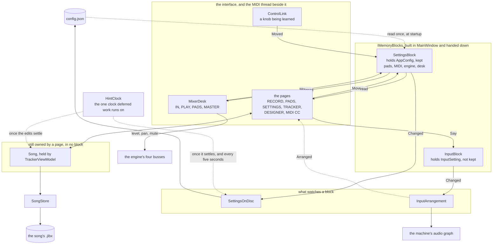

# Blocks in memory

What this application knows is in three unrelated places and written down by three unrelated
mechanisms: the settings in one flat object saved by hand from thirty-four call sites, a song
saved by the tracker and copied for a crash on a clock of its own, and the pads saved with the
settings but edited and undone through their own history. This is the plan for making all of it
one shape: **the interface writes a block in memory, and everything else observes that block,
the file writers included.**

Nothing here is built yet except the input's own corner of it, which was written on 2026-09-11
to fix a fault that is the whole argument for the rest.

## Why

**A page owned a fact about the machine, and audio went out because of it.** The input was set
to a browser with Hear it off, which is the quiet setting somebody uses to line a source up
before they need it. Changing tab let the browser back onto the speakers a second or two later,
with nothing on the screen saying so.

Two things under that, and both are ownership rather than arithmetic:

- `Standing`, which registers that the input has to stay open and the graph watched, was called
  from the Hear it setter and not from the source picker, although its own rule counts both. So
  choosing a source registered no reason at all.
- The holding that puts back what the machine's session manager has re-wired lived inside a
  reading that the mixer and RECORD start when they are drawn and stop when they are put away.
  Leave both pages and nobody was holding anything.

The log said it in four lines: `took Firefox off 2 link(s)` at 20:42:44, `put 2 link(s) back` at
20:44:59 on the way out, and nothing whatever in between.

**And the settings are written down by hand in 34 places**, 23 of them in `MainViewModel`. Every
one is a chance to forget, and forgetting is silent: the setting is right on the screen and gone
in the morning. It is also how two threads came to be writing the settings file at the same
moment, which cost a rule of its own in `SafeFile`.

## The shape

```
  the interface  ──writes──▶  a block  ──observed by──▶  its writer, in its own format
                                  │                      the routing
                                  └──read by─────────▶   the views
```

**Every writer is an observer, and each one owns its format.** A song is a zip with a document
and a patch per plugin; the settings are one JSON file written whole; the pads are part of that
file today and need not stay there. None of that is the manager's business: a block says what it
holds, and whoever writes it says how. What they share is the shape, not the format.

One direction. Nothing in the interface reaches the machine, and nothing on the machine reaches
back into a page.

**This is the tracker's shape said again.** A song is the block, the pages edit it, and
`TrackerPlayer` observes it and makes the plugins and the mixer agree, only where they differ.
Settings are the same three parts, and doing it this way leaves the application with one pattern
instead of two.

## The flow as it really is

The sketch above is the shape being aimed at. This is what the code does on 2026-09-12, with the
real type names in it so it can be checked against the tree rather than believed, and with what is
still missing drawn rather than left out: a diagram of the intention is the thing that goes stale
without anybody noticing.



**What that says, and what it says that the shape above does not.**

- **The desk is a section of the settings, not a block with a writer of its own.** `MixerDesk`
  holds the four strips that belong to this machine rather than to a song: the recording input, a
  take being auditioned, the pads together, and what leaves the machine. Each value is in
  `AppConfig` and the bus is told, so there is one of it. Before this they were fields on the
  busses and in no file at all: set the master fader, restart, and it was at unity again with
  nothing saying why.
- **The input's fader is the one thing on the desk that is not a bus's level.** It is the gain on
  what is coming in, before anything is written, so it decides what a take holds rather than what
  the desk sends out. That is why the strip says Gain where the others say Level, and why the
  number stays in `AppConfig.RecordGainDb`, where every settings file already written has it.
- **There is one clock for deferred work and it is `HintClock`.** Six classes each kept a timer of
  their own at five different rates, started and stopped by hand: the settings file, the rack, a
  pad's chain, the recorder's chain, the input closing and the song's rescue copy. They are hints
  now, and letting the clock go on the way out answers everything still owed. What is left in the
  application are polls, which are a different family: meters, plugin parameters, the graph
  reading.
- **Two blocks exist, not five.** The pads are not one: `AppConfig.Pads` and `Profiles` are fields
  in the settings document, so they are inside the settings block and written by its writer.
- **The song is still not in the manager.** `TrackerViewModel` owns it and `SongStore` writes it.
  It keeps the shape anyway, which is why it was the argument for all of this, and nothing hands
  it down: no other page can ask the manager for it. It is the one box left outside the blocks.
- **The interface is not the only writer.** `ControlLink` writes a learned knob from the MIDI
  thread, which is why the settings file used to be written from two threads at once.
- **Nothing observes a block except its watchers.** A view reads the block it is drawn from and is
  told by the ordinary property change of whichever page holds it. That is the half of the sketch
  above that is not built: there is no general "the block moved, redraw" anywhere, and where two
  views show one fact they do it by both reading the same object.

## What a section is

A named block of facts that belong together, which says two things about itself: **what it
holds, and whether it is kept.** The unit matters twice over, because it is both what an observer
subscribes to and what the writer decides about.

Sections already half exist. `AppConfig.Midi` is one, a nested `MidiConfig`; the other fifty
properties are flat on the same object. What the plan adds is a home for the rest and a
notification when one moves.

As they stand today, the sections would be:

| section | holds | kept |
|---|---|---|
| Audio | the output by id and by name, the sample rate, the buffer, the update period and threads, render-ahead, the realtime tick, the drive curve, plugin overlapping | yes |
| Midi | the ports, their roles, the controller links | yes |
| Record | the gain, the input device by name, the effect chain | yes |
| Pads | the matrix, the pads themselves, toggle mode, the pulse | yes |
| Keys | the shortcuts that differ from the defaults | yes |
| Look | the theme, the window | yes |
| **Input** | **the chosen source, Hear it, what we play out of** | **no** |

## Two kinds of fact, and the one rule that must not bend

**What is kept** survives the run and is what the writer writes.

**What is true this run** is never written, and the input section is the whole of it today. That
is a decision with a reason: an application that started with somebody's browser already
unplugged from its own speakers, or with a microphone already open into the mix, would be doing
something that morning that nobody had asked for. It is also why the section is the unit. Written
as a mark on a field inside a kept block, the one rule that matters would be guarded by an
attribute somebody can forget; written as a property of the section, the writer never sees it.

## Settings are not machine truth

`IInputSource` today carries five things, and only two of them are settings:

```
Routes             what the machine is offering at this moment
SelectedRoute      a setting
Hearing            a setting
CanHear            a rule over one of each
IsRoutingAvailable what the machine can do at all
```

The list of sources is read off the audio graph every couple of seconds and belongs to the
routing observer as something it publishes; the chosen source is a setting. Keeping them in one
interface is what makes the mixer's IN strip reach through `RecordViewModel` to change what the
machine is wired to. Split, the strip writes a section like any other control, and the list it
offers comes from the thing that reads the graph.

## The observers

**The writers, one per document.** Each watches the blocks it is answerable for and writes them
in its own format once the changes have settled:

| writer | watches | format | settles |
|---|---|---|---|
| the settings | Audio, Midi, Record, Keys, Look | one JSON file, written whole | a moment |
| the song | the open song | `.jibx`, a zip with `song.json` and a patch per plugin | on asking |
| the rescue copy | the open song | the same zip under another name | twenty seconds while dirty |
| the pads | Pads | wherever they end up living | the chain's own settle |

**Two writers over one block is the ordinary case rather than a problem**, and the song already
proves it: what you press Save for and the copy kept against a crash are the same block written
twice, in the same format, on different clocks and to different files. Today they are two
hand-written paths that each remember to be called.

A settle is not politeness. A fader dragged across its range is one thing a person did and a
hundred notifications, the record gain already waits half a second by hand, and a pad's chain
waits six hundred milliseconds. One rule instead of three.

**The routing.** Built on 2026-09-11 and already in this shape: `IInputSetting` is the section,
`IInputArrangement` watches it, makes the machine match on a change and holds it against the
session manager on a clock of its own that runs for the length of the session. It publishes what
came of the arrangement, and says out loud when the machine has undone it.

**The views.** A page reads a section and writes it, and that is all a page does. Two pages over
one section is then the ordinary case rather than a coupling: RECORD and the mixer's IN strip are
two views of the input exactly as the pattern and the mixer are two views of one song.

## What any observer here has to keep

Every one of these has already been paid for once.

1. **Compare before acting.** The graph is read every two seconds and hands back fresh objects
   each time, so a source compared by object reads as chosen again on every reading and the
   machine is rewired for it, which is audible. `MatchChains` keeps the same rule on the song
   side: chains are made to agree only where they differ, because rebuilding one is seconds a
   plugin.
2. **A gesture is one change.** The input's three facts are said together for this reason: a
   source applied before the output it is checked against is known is the machine chasing a
   state nobody asked for.
3. **Settle before writing.** A fader dragged across its range is one thing a person did and a
   hundred notifications.
4. **Never write what must not be kept.** See the section table.
5. **Answer back through the block or an event, never by calling a page.** What came of an
   arrangement is read off the observer or arrives as an event; the observer does not know a
   page exists.
6. **Raise anywhere, marshal at the interface.** An observer runs on whatever thread it has; the
   page is the one that has to get a status line onto the drawing thread.

## One of them, handed down, never reachable

There is one manager because there is one application, so it is built where the settings are read
and passed to whoever needs a block. What it must not have is a `Current`, an `Instance` or a
static `Default`.

Three reasons, each specific to this codebase. A manager anybody can reach from anywhere makes
reaching the easy thing to do, which is the coupling the input fault was; this executable runs
again as a plugin's host, where there are no settings at all, which is why `AppFolder` is built
to work without them; and two and a half thousand tests run in one process one at a time, where
shared state leaks from test to test and the suite goes quietly wrong rather than failing.

The precedent is `ControllerProfiles`, which genuinely has to be shared: `MainViewModel` makes one
and hands it to the router, the layout, the codecs and the pages, and everything that takes one
still defaults to its own so that a panel or a test built alone works. `DefaultLayoutTests` failed
the moment it stopped being shared, which is how that hazard was found.

Not every block is per-application either. The settings are, the routing is, a song is per
document: a manager handed down can hold a second song without a fight, and packing a song or
comparing one with what is on disc is where that would show.

## The order of the work

Each step is worth doing on its own and leaves the application working.

1. **Build the manager and the blocks, hand them down from `MainWindow`.** Done on 2026-09-11:
   `IMemoryBlocks` holds the settings and the input, built beside the engine and handed to
   `MainViewModel`, which hands the input's setting to RECORD. `IMemoryBlock` is what a block
   says about itself, which is its name and whether it is kept, and it is a wrapper rather than
   the document because anything added to `AppConfig` lands in everybody's settings file. Nothing
   observes the manager yet and no behaviour changed, which the suite staying green is the proof
   of.
2. **Move the input section into it.** Done on 2026-09-11: the setting is the block's, built in
   `MemoryBlocks` and handed down to RECORD, and `IInputArrangement` is what watches it. The page
   writes the setting and hears what came of it back through `Arranged`; nothing on it waits for
   the graph's tools to run, and nothing about the machine depends on which page is drawn.
3. **Split `IInputSource`** into the section the interface writes and the view of what the
   machine is offering. Done on 2026-09-11, as `IInputChoice` and `IInputOffers`, with the union
   kept for what wants both. The machine work went with it: `IInputPath.Set` makes both moves,
   taking the source off its own output and pointing the capture at it, so the order between them
   is decided in one place rather than by whichever call site ran. The two are asked at different
   rates, which is the one rule in it worth remembering: taking a source aside again is audible
   and is held on a clock instead, and pointing the capture is a link and is made good on every
   call. That is what lets a reading of the graph that finds the capture re-pointed ask for the
   arrangement `Again` and get one.
4. **Make the writer an observer** and delete the 34 calls. Done on 2026-09-11.
   `ISettingsOnDisc` follows the settings block on a clock of its own: it is told when something
   moves, so the file keeps up with a hand, and it also compares what it would write with what it
   wrote, so a change nobody announced is written anyway. Nothing else in the application holds a
   `ConfigStore`, and the pages are handed `ISettingsBlock` where they used to be handed the store
   and the document. What went with the calls: two hand-rolled debounces at two different rates,
   RECORD's gain timer and the window's resize timer; two threads writing one file; and the whole
   class of fault where a field is changed and nobody remembers to write it down.

   The one thing it needed underneath was `ConfigStore` letting go of the document. Writing the
   settings used to stamp a version on them, normalise them and rewrite every pad's source as
   `{app}/` before putting it back in a `finally`, which is fine on the thread that asked and is
   not fine on a clock: the window it opens is over the path every pad plays. It works on a copy
   now, and normalising goes with it, since the document is put in order when it is read.

5. **The mixer desk.** Done on 2026-09-12. `IMixerDesk` is the four strips that belong to this
   machine rather than to a song, and it is a section of the settings rather than a block of its
   own: a second block would want a second writer, and there is one of those already. Each value
   is in `AppConfig` and the bus is told in the same breath, so a strip is one value rather than
   one on each side of a copy. What it ended was three strips whose level, pan, mute and solo
   lived on the engine's busses and in no file at all.
6. **One clock for deferred work.** Done on 2026-09-12. `IHintClock` and `IHint` in `Hints/`:
   something says it moved as often as it likes, and the work follows once the saying stops, or
   anyway once it has waited as long as it is allowed to. Six classes each kept a timer of their
   own at five different rates, and a seventh would have been written the next time somebody
   needed the same thing. Letting the clock go on the way out answers everything still owed,
   which is what six separate `Stop` calls could not promise between them.

## Left open

**The file on everybody's disc is the constraint.** `AppConfig` is written as one flat JSON
object, and every settings file already written is that shape. Sections in memory do not have to
mean sections in the file: the simplest first step is sections as views over the same document,
with the file untouched. If the file is ever reshaped it wants the rule the song format already
keeps, which is that a file with no version in it is older than the field and is read as what it
was.

**Where the pads' file ends up.** They are a block with a writer like everything else, which
answers how they are saved; what it does not answer is whether they stay inside the settings
file or get one of their own. Their undo is untouched either way: a history is about what the
block holds and has nothing to do with who writes it down.

**What a section is in code** is deliberately not decided here: one interface with a name and a
changed event, or a base class, or a record in a dictionary. It should be decided against the
first two sections that are actually moved rather than in the abstract.
